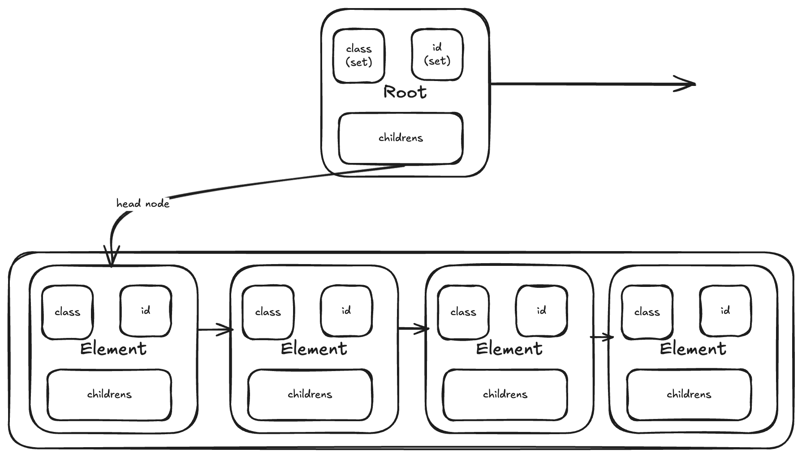

# DOM

Purpose: Implementing internals of browser to gain deeper understanding of rendering works

This project is steping stone for a future html parser project(kinda like JSDom).

## Architecture

Each node contains 3 props(as of the latest commit), namely:
1. id: Currently a set but in future would be replaced with string,
2. classes: Object of ClassList, which internally contains set of classes and allows to perform fast search on them,
3. childrens: Doubly linked list.

The main idea is to make a m-tree which is easy to traverse